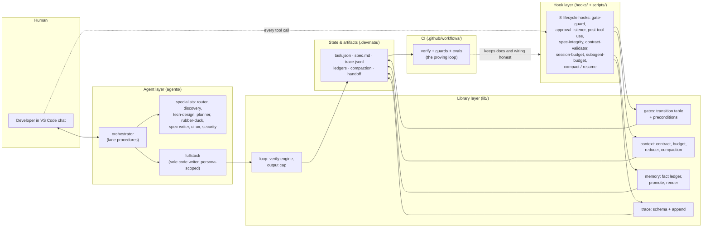

# ARCHITECTURE.md v2

> **Version:** 2.0.0 — reflects the end state after release 0.5.0  
> **Previous version archived at:** `docs/archive/ARCHITECTURE.v1.md`  
> **Status:** Authoritative for component architecture, lane procedures, and data flow. If runtime behavior differs from this document, the runtime has a bug. See [SYSTEM_OVERVIEW.md](./SYSTEM_OVERVIEW.md) (E9-28) for the integrated end-to-end view.

---

## What devmate is

devmate is a VS Code custom-agent plugin that enforces a **deterministic, stage-gated software development workflow**. It wraps your development requests in a structured pipeline of specialist agents — for analysis, planning, critique, and design — and routes all code-writing work through a single implementation engine that follows test-driven development.

The system is built on three ideas:

1. **Workflow-first.** The orchestrator defines the procedure. Agents execute narrow steps inside that procedure. No agent invents the workflow for itself.
2. **One code writer.** A single generic `fullstack` agent handles all implementation. Its behavior is shaped by a runtime persona from `devmate.config.json`. Specialists analyze, plan, and critique; `fullstack` builds.
3. **Structural safety.** Quality and correctness are not enforced by instructions alone. They are enforced by typed artifacts, hook-based gate guards, scope contracts, TDD requirements, and CI tests that prove the docs and runtime agree.

---

## System diagram

The runtime in one picture — who talks to whom, layer by layer. Per-edge interaction detail (which hook fires on which event, which artifact proves which gate) lives in [SYSTEM_OVERVIEW.md](./SYSTEM_OVERVIEW.md); the component depth for each box is the rest of this document.



---

## Request flow

A request enters as a chat prompt and leaves as a reviewed PR, never skipping a stage: the orchestrator has `@router` classify the lane and budget class (low confidence escalates to the human), writes the budgeted `OutputContract` into `task.json`, and takes an advisory model-route hint; discovery and tech-design fan out in isolation and merge into `discovery-done`; `@rubber-duck` grills the findings (`grill-done`), the plan is written and critiqued (`plan-done`), and `@spec-writer` produces `spec.md` (`spec-draft`) — which only a human reply can promote to `spec-approved`, after which the spec's recorded digest makes silent edits roll the gate back. Implementation then runs entirely inside the guardrails: every tool call passes the fail-closed gate-guard (gate, persona scope, TDD evidence, shell analysis), every edit is traced and written to the fact ledger, and the session budget is metered against the contract's class. The verify→fix→verify loop must leave a fresh, spec-matched `verify-result.json` before the `verification-passed` gate will open; a security review and a human PR approval take the task through `pr-ready` to `done`, while compaction promotes what was learned into the repo ledger for the next session. The fully cited ten-step version of this walkthrough is [SYSTEM_OVERVIEW.md §2](./SYSTEM_OVERVIEW.md).

---

## Conversational robustness layer (E10)

Between the human and the gate machinery sits an interpretive layer with one stance: **the LLM interprets free-form human input, the state machine validates the resulting transition, and hooks enforce it deterministically.** Code never guesses intent; the model never bypasses a precondition. Concretely:

- **Every turn starts from durable state.** The UserPromptSubmit and SessionStart hooks inject a model-visible devmate-state block (taskId, lane, gate, step, legal next gates) built by `lib/orchestrator/state-anchor.mjs` from `task.json`, so the orchestrator is re-anchored even after long free-form stretches.
- **Every in-flight message is classified before action.** A deterministic fast path in the approval listener persists a per-prompt verdict; deferred turns are classified by the orchestrator as a structured intent object per its Turn routing preamble. Read-only intents (question / status / chat) can never move a gate; ambiguity at a human review defaults to revision, never approval.
- **Human-gate transitions are orchestrator-issued commands.** After classifying explicit approval, the orchestrator runs the gatectl advance itself with an actor + evidence audit pair; the exact approval phrases remain a hook fast path. A human-gate advance without the audit pair is refused.
- **Steering is a transition, not a derailment.** The lane-agnostic steering table makes mid-workflow scope changes, parking, resuming, and abandoning legal, precondition-gated moves that preserve the task.
- **The layer is regression-graded end-to-end** by the gate-robustness eval (paraphrased approvals, change requests, interruptions; end-state grading; a never-false-approve property).

The authoritative narrative — the three-layer model, the per-turn lifecycle, and the intent-to-action table — is [orchestrator-conversation.md](./orchestrator-conversation.md). Patterns P16–P18 (with P13–P15) in [PATTERNS.md](./PATTERNS.md) catalog the layer with honest enforcement status.

---

## Why this shape

- **Workflow-first, agent-second.** The procedure is data (a frozen transition table plus per-lane step lists), so the same request takes the same path twice, failures localize to a stage with an artifact trail, and no agent can invent its own process. The model is a worker inside the workflow, never the scheduler.
- **One code writer.** Concentrating all source edits in `fullstack` — persona-scoped, TDD-gated — means analysis can fan out aggressively without two agents fighting over a file, and every change is attributable to one persona, one gate, one trace.
- **Structural safety over prompt trust.** Rules live where they cannot be ignored: typed artifacts that have no field for transcripts, transition tables with no illegal edge, fail-closed hooks that deny rather than warn, and CI checks that fail the build when docs and runtime disagree. What is only prompt-deep is labelled so honestly (`prompt-only` / `aspirational`) in the pattern catalog — and that labelling is itself machine-checked.

Design principles are catalogued once, not duplicated here: see [docs/PATTERNS.md](./PATTERNS.md) — the single source of truth for patterns, each with its Benefit and machine-checked Enforcement status.

---

## System Components

```
devmate/
├── agents/                    # All .agent.md files — one per agent
├── hooks/
│   └── hooks.json             # Plugin-level hooks for all 8 VS Code lifecycle events
├── scripts/                   # Shell/Node scripts invoked by hooks
│   ├── gate-guard.mjs         # PreToolUse: blocks tool calls outside scope
│   ├── post-tool-use.mjs      # PostToolUse: scope enforcement, contract validation
│   ├── approval-listener.mjs  # UserPromptSubmit: spec approval gate transition
│   ├── spec-integrity-guard.mjs # PostToolUse: guards spec.md from mutation
│   ├── subagent-budget-guard.mjs # SubagentStart/Stop: token budget tracking
│   ├── check-session-budget.mjs  # PostToolUse: session-level budget
│   ├── session-start.mjs      # SessionStart: initialize task state
│   └── session-stop.mjs       # Stop: teardown and trace flush
├── lib/
│   ├── workflow/lanes/
│   │   ├── feature.mjs        # continueApprovedFeature(), gate transitions
│   │   ├── bug.mjs            # runBugHandoff(), runBugLane()
│   │   └── chore.mjs          # continueApprovedChore(), escalateChoreToFeature()
│   ├── gate-guard-core.mjs    # Gate enforcement rules
│   ├── gate-transitions.mjs   # Legal gate transition map
│   ├── spec-writer.mjs        # writeSpec() — generates spec.md from plan
│   ├── task-state.mjs         # Read/write task state JSON
│   ├── workstream-partitioner.mjs # Splits feature into parallel workstreams
│   ├── persona-instructions.mjs   # Loads persona context from devmate.config.json
│   └── workflow/bug-handoff.mjs   # Validates DiagnosisResult, dispatches fullstack
├── skills/                    # VS Code slash-command entry points
│   ├── devmate-init           # /devmate-init
│   ├── devmate-map            # /devmate-map
│   └── tdd-debug              # /tdd-debug
├── src/
│   └── types.mjs              # TypeScript-style type definitions
├── .devmate/                  # Runtime layout (per-workspace)
│   ├── devmate.config.json    # Persona config, health predicates, budget rules
│   └── session/               # Per-task artifacts and state
└── test/
    ├── workflow/              # E2E lane tests (feature, bug, chore, missing-agent)
    └── docs-sync.test.mjs     # Asserts runtime and docs are consistent
```

### E8-1 Orchestrator-workers fanout

`lib/orchestrator/fanout.mjs` runs an array of worker thunks in parallel using
`Promise.allSettled`. Every settled worker is validated against the E4-8
`WorkerReturn` contract; failures (rejection, timeout, or schema violation)
accumulate in `FanoutResult.violations` and never abort the batch. Per-worker
telemetry is appended to `evals/telemetry/workers.jsonl` via
`lib/orchestrator/telemetry.mjs`.

Timed-out workers receive an `AbortSignal` abort (best-effort cancellation for
abort-aware worker implementations), and callers may set
`minSuccessRate` to mark a run as `insufficient` when too few workers succeed.

By default (when `opts.strict` is `false` or absent) any budget class is
permitted. When `opts.strict` is `true`, the function enforces
`budgetClass === 'large'` — restoring the legacy E8-1 conservative gate. The
`strict` default is provisional and will be calibrated after the E8 evaluation
phase (see `// TODO` comment in the module). Note: this module is a standalone
programmatic utility; VS Code subagent dispatch (Step 2 `@discovery` +
`@tech-design` fan-out and Step 12 `@fullstack` dispatches) uses VS Code's
native `agent` tool and is not wired through `fanout.mjs`.

---

## Lane Architecture

All three lanes share the same entry point: `@orchestrator`. The orchestrator classifies the request, sets the budget class, writes an initial `OutputContract`, and executes the appropriate lane procedure.

### Feature Lane

The feature lane is the full stage-gated pipeline for new functionality.

```
Step 0   [@router]         Classify lane (feature/bug/chore) → {lane, budgetClass, confidence}
                          If confidence < 0.75, ask human to confirm; if error, halt
Step 1   [orchestrator]    Write OutputContract, set BudgetClass, advance lane-set gate
Step 2   [fan-out]         @discovery + @tech-design in parallel (P5 isolation)
Step 3   [auto-gate]       discovery-done (both fan-out contracts merged)
Step 4   [@rubber-duck]    mode=grill — hunt [UNVERIFIED] in discovery output
Step 5   [auto-gate]       grill-done
Step 6   [@planner]        Write implementation plan with AC/TDD mapping
Step 7   [@ui-ux]          Write UI brief (runs parallel with or after planner)
Step 8   [@rubber-duck]    mode=critique — challenge the plan
Step 9   [@spec-writer]    Call writeSpec() → produce .devmate/session/spec.md,
                          then gatectl workflow set draft-spec (HITL-2: the only
                          legal move out of plan-approved on the feature lane)
Step 10  [HUMAN GATE]      spec-approval — human reviews spec.md
Step 11  [orchestrator]    continueApprovedFeature() → partition workstreams
Step 12  [fan-out]         @fullstack ×N (one per persona workstream)
Step 13  [TDD loop]        verify → fix → verify (P4 per workstream)
Step 14  [@frontend-tester] E2E/component tests after the backend-ready milestone
Step 15  [@security]       Pre-PR security diff review
```

**Gate map:**

| Gate | Trigger | Auto or human |
|---|---|:---:|
| `lane-set` | Lane classified | Auto |
| `discovery-done` | Both fan-out agents return valid contracts | Auto |
| `grill-done` | `GrillResult` artifact written | Auto |
| `plan-done` | Plan artifact written and critique resolved | Auto |
| `spec-draft` | `spec.md` written (non-empty — precondition-enforced), orchestrator issues the draft-spec advance; HITL-2: the only legal exit from `plan-approved` on this lane | Auto |
| `spec-approved` | Human approval classified per the gate conversation protocol (explicit affirmative in any phrasing; exact phrase is a hook fast path) | **Human** |
| `impl-started` | `continueApprovedFeature()` called — requires `spec-approved` plus recorded spec artifacts (always-on precondition, independent of delegationFloor) | Auto |
| `verification-passed` | Verification loop verdict is pass | Auto |
| `pr-ready` | Security review passes, all tests green | Auto |

Progress markers such as design-done (tech-design contract returned) and backend-ready (backend verification passed) are prose milestones only — they are **not** `workflowGate` values and never appear in `state.workflowGate`.

Entry to `pr-ready` carries two config-gated preconditions on top of the transition table, both off by default: the AC-coverage backstop (`acCoverageGate`) and the PRR-3 pr-review precondition (`prReviewGate`). With `prReviewGate` set to `block`, the advance from `verification-passed` into `pr-ready` is refused until the `/devmate-pr-review` skill has recorded a valid APPROVE verdict for the task; `warn` records the violation but allows the advance (see [docs/config.md](./config.md#pr-review-gate-optional)).

---

### Bug Lane

The bug lane is a strict 9-step procedure with hard rules for diagnose-before-fix, schema validation, `scope.md` enforcement, and edit-scope guardrails. The complete procedure is documented in [agents/orchestrator.agent.md](../agents/orchestrator.agent.md) under "Bug lane — orchestration sequence".

```
Step 0  [@router]       Classify lane (feature/bug/chore) → {lane, budgetClass, confidence}
                        If confidence < 0.75, ask human to confirm; if error, halt
Step 1  [orchestrator]  Write OutputContract, set budget class, produce DiagnosisRequest
Step 2  [@diagnose]     Reproduce bug, identify root cause, write DiagnosisResult + scope.md
Step 3  [orchestrator]   Validate DiagnosisResult via validateDiagnosisResult()
Step 4  [@rubber-duck]   mode=grill — challenge diagnosis assumptions
Step 5  [orchestrator]   Advance gate plan-approved → impl-started via gatectl
Step 6  [@fullstack]     TDD constraint: write failing regression test first → fix → green
Step 7  [verify]         Run verification via verify-step loop (P4 tier)
Step 8  [@security]      Security diff review (conditional on risk level)
Step 9  [orchestrator]   Human review and pr-ready approval gate
```

**Gate map:**

| Gate | Trigger | Auto or human |
|---|---|:---:|
| `plan-approved` | Bug classified — `init-task-state` seeds the task here | Auto |
| `impl-started` | Orchestrator issues gatectl advance before @fullstack dispatch | Auto |
| `verification-passed` | Verification loop verdict is pass | Auto |
| `pr-ready` | Human review complete, fix approved | Human |

The bug lane's gate sequence is exactly `plan-approved → impl-started → verification-passed → pr-ready → done`, per the unified transition table (`lib/gate-transitions.mjs`). The diagnosis-done marker (DiagnosisResult validated by `validateDiagnosisResult()`) is a prose milestone only — it is **not** a `workflowGate` value. The Step 4 grill milestone is recorded as a `grill_complete` trace event; the `grill-done` gate belongs to the feature lane's spec spine and is not part of the bug lane's gate sequence. Like the feature lane, entry to `pr-ready` is additionally gated by the config-gated pr-review precondition (`prReviewGate`, off by default): in `block` mode the advance into `pr-ready` requires a recorded APPROVE verdict from the `/devmate-pr-review` skill.

**Edit safety:** `scope.md` written by `@diagnose` defines the allowed file list. The gate-guard's `PreToolUse` hook (Rule 6) enforces the scope uniformly for all lanes via `lib/workflow/scope.mjs:enforceScope`. The former `enforceBugScope` predicate has been removed (P06); enforcement now reads `.devmate/session/{taskId}/scope.md` through `evaluateGuard` in `lib/gate-guard-core.mjs`.

---

### Chore Lane

```
Step 0  [@router]       Classify lane (feature/bug/chore) → {lane, budgetClass, confidence}
                        If confidence < 0.75, ask human to confirm; if error, halt
Step 1  [orchestrator]  Write scope.md and OutputContract
Step 2  [@fullstack]    Execute mechanical changes under persona=editor
Step 3  [verify]         scripts/verify-step.mjs confirms changes
Step 4  [orchestrator]   escalateChoreToFeature() if scope exceeded
```

**Gate map:**

| Gate | Trigger | Auto or human |
|---|---|:---:|
| `lane-set` | Chore classified | Auto |
| `verification-passed` | Verification passes | Auto |
| `pr-ready` | Diff is scope-clean | Auto |

Progress markers such as scope-written (`scope.md` written) and escalated (chore exceeded allowed scope and becomes a feature; also the `status: escalated` result value) are prose milestones only — they are **not** `workflowGate` values.

---

## Hooks Architecture

devmate registers hooks for all eight VS Code Copilot lifecycle events. Hooks are delivered as plugin-level `hooks/hooks.json` — the canonical delivery mechanism for this internal tool.

| Hook event | Script | Purpose |
|---|---|---|
| `SessionStart` | `session-start.mjs` | Initialize task state, load config, validate agents |
| `UserPromptSubmit` | `approval-listener.mjs` | Inject the workflow-state anchor and persist the turn-intent fast path on every prompt; exact approval phrases advance the gate as a fast path |
| `PreToolUse` | `gate-guard.mjs` | Block source edits that violate gate state or scope contract; deny lane-gated implementation dispatches (P26) |
| `PostToolUse` | `post-tool-use.mjs` | Validate output contracts, enforce scope, run budget checks |
| `PostToolUse` | `spec-integrity-guard.mjs` | Block any mutation to `spec.md` after approval |
| `PostToolUse` | `check-session-budget.mjs` | Track session token spend against budget class |
| `SubagentStart` / `SubagentStop` | `subagent-budget-guard.mjs` | Track subagent token budget; deny implementation dispatches whose lane gates/artifacts are absent (P26) |
| `Stop` | `session-stop.mjs` | Flush trace log, persist final state |

**Hook path resolution:** Plugin hooks reference scripts using `${PLUGIN_ROOT}` for Claude-format plugins or the plugin root path for Copilot-format plugins. VS Code resolves these automatically for installed plugins. A CI validation step confirms every hook command resolves to an existing script at package time.

**Agent-scoped hooks (preview):** Individual agents may define hooks in their frontmatter using the `hooks:` field when `chat.useCustomAgentHooks` is enabled. This is used for strict formatters or agent-specific enforcement layers. See VS Code docs for the `hooks` frontmatter field.

---

## Artifact and State Model

Each lane run produces a set of typed, persisted artifacts in `.devmate/session/{taskId}/`. Agents do not communicate through chat context alone — they communicate through these artifacts. This is the structural anti-hallucination foundation: no agent may claim knowledge it does not hold as a readable artifact.

```
.devmate/
└── session/
    ├── spec.md                        # Human-reviewed spec (feature lane only)
    └── {taskId}/
        ├── discovery.json             # EvidencePointer[] from discovery agent
        ├── design.json                # Design contract from tech-design agent
        ├── plan.json                  # Implementation plan from planner agent
        ├── critique.json              # GrillResult/CritiqueResult from rubber-duck
        ├── ui-brief.json              # UI brief from ui-ux agent
        ├── scope.md                   # Allowed edit boundaries (all lanes)
        ├── diagnosis.json             # DiagnosisResult from diagnose agent (bug lane)
        ├── security.json              # Security review notes from security agent
        └── trace.jsonl                # Event log — one JSON line per lifecycle event

      .devmate/
      ├── memory/
      │   └── tasks/
      │       └── {taskId}.jsonl             # Task-local staged facts (append-only)
      ├── state/
      │   ├── task.json                      # Task state — gate value, lane, artifactHashes.
      │   │                                  #   Written ONLY by hooks (gate-advance,
      │   │                                  #   approval-listener): no agent can move a gate.
      │   ├── router-result.json             # Evidence for lane-set
      │   ├── discovery-merged.json          # Evidence for discovery-done (fan-in)
      │   ├── grill-result.json              # Evidence for grill-done
      │   ├── critique-result.json           # Evidence for plan-done
      │   ├── worker-returns/                # One file per dispatch, keyed by tool_use_id
      │   └── repo/
      │       └── repo.jsonl                 # Promoted active facts across completed tasks
      └── .devmate/MEMORY.md                 # Marker-bounded rendered memory view
```

**Trace events** — minimum required:

```
lane.started | lane.resolved | agent.registry.loaded | agent.missing
step.started | step.completed | step.failed
contract.validated | contract.invalid
gate.advanced | gate.blocked
lane.completed | lane.failed
```

---

## Memory System

The memory subsystem is a three-stage pipeline that separates collection,
promotion, and rendering:

1. **Collect (task-local):** `hooks/post-tool-use.mjs` records fact lines to
  `.devmate/memory/tasks/<taskId>.jsonl`.
2. **Promote (shared state):** task completion and compaction run promotion into
  `.devmate/state/repo/repo.jsonl` with deterministic conflict handling.
3. **Render (human-readable):** `lib/memory/render-memory.mjs` regenerates the
  marker-bounded section of `.devmate/MEMORY.md` from promoted active facts.

Path construction and validation are centralized in `lib/memory/paths.mjs`.
Task ledgers are fail-closed by task-id validation (`TASK_ID_RE`) before any
write or promotion path is derived.

**Conflict identity:** facts are keyed by `FactEntry.key` (with legacy
source-based fallback where needed). Promotion conflict policies apply to key
collisions; distinct keys from the same source can coexist.

**Compaction integration:** `scripts/compact-session.mjs` promotes the active
task ledger and renders `.devmate/MEMORY.md` before writing the compaction artifact,
ensuring memory state stays current during session turnover.

---

## Persona Model

`fullstack` behavior is driven by a persona loaded from `devmate.config.json`. The persona defines:

- `allowedGlobs` — which files this persona may edit,
- `offLimitsGlobs` — files this persona must never touch,
- `techStack` — language, frameworks, and conventions,
- `testingConventions` — test runner, naming, coverage expectations,
- `tddRequired` — boolean, always `true` in production,
- `healthPredicates` — commands that confirm the environment is healthy before starting.

The gate guard reads `scope.md` and the persona's `offLimitsGlobs` to build the final allowed-edit list at runtime. The two lists are intersected, so the narrower of the two always wins.

**Wrapper agents** (`backend`, `frontend`, `editor`) are the mechanism the orchestrator uses to name the target persona at dispatch time. They contain no logic of their own.

---

## Reliability Model

devmate prevents hallucination and workflow drift through five layers:

1. **Typed artifacts with schema validation**  
   Every agent output is validated against a typed schema by the `PostToolUse` hook. Malformed outputs block lane progression with a user-visible error. Schema validation also runs in CI.

2. **`[UNVERIFIED]` tag protocol**  
   Any claim not backed by direct file evidence is tagged `[UNVERIFIED]`. `rubber-duck` is required to explicitly surface all `[UNVERIFIED]` items during the grill and critique passes. Unresolved `[UNVERIFIED]` items in the final spec are carried as open risks, not silently dropped.

3. **Gate guard hooks**  
   `PreToolUse` hooks block source edits that violate gate state and deny implementation-agent dispatches whose lane gates and artifacts are absent (P26 — lane-gated implementation dispatch); the `SubagentStart` budget guard is a second, independent layer for that same dispatch check. `PostToolUse` hooks enforce `scope.md` boundaries and validate contracts. This creates hard enforcement that does not depend on the model following instructions.

4. **Fail-loud on missing agents**  
   If any required subagent dispatch returns an empty or unresolved result, the orchestrator stops the lane immediately. No gate may advance on an empty dispatch result. The user sees a specific error naming the missing agent or malformed contract.

5. **Docs-sync and E2E tests**  
   `test/docs-sync.test.mjs` asserts that `docs/AGENTS.md` and the runtime agent files agree. E2E lane tests (`test/workflow/`) prove that each lane executes its full step sequence using a mock executor, including gate blocking on missing artifacts and fail-loud behavior on missing agents.

---

## VS Code Customization Model

devmate uses the VS Code custom-agent system. Key conventions:

- **Agent files** are Markdown files with `.agent.md` extension in the `agents/` directory. VS Code detects all `.agent.md` files in `.github/agents/` or the directory configured for the plugin.
- **Frontmatter fields** supported: `name`, `description`, `argument-hint`, `tools`, `agents`, `model`, `user-invocable`, `disable-model-invocation`, `handoffs`, `hooks` (preview), `target`.
- **`tools` field** uses VS Code built-in tool names. The correct tool name for task tracking is `todo`, not `todos`. Use `search`, `edit`, `execute`, `codebase`, `web/fetch`.
- **`agents` field** controls which subagents this agent may dispatch. Use `*` to allow all, `[]` to disallow any, or an explicit list.
- **`user-invocable: false`** hides the agent from the VS Code chat dropdown. Subagent-only agents must carry this flag.
- **`disable-model-invocation: true`** prevents the agent from making additional model calls as a subagent, useful for read-only analysts.
- **Handoffs** appear as button prompts in VS Code chat. Each handoff targets a named agent, with optional pre-filled prompt and `send: false` to let the user review before submitting.
- **Hook file location:** The canonical plugin hook file is `hooks/hooks.json`. VS Code also recognizes workspace hook files in `.github/hooks/` and custom locations via `chat.hookFilesLocations`.

---

## Configuration Reference

`devmate.config.json` (located at `.devmate/devmate.config.json`) is the single source of truth for runtime behavior:

```json
{
  "version": "2.0.0",
  "personas": {
    "backend": {
      "allowedGlobs": ["src/main/**", "src/test/**"],
      "offLimitsGlobs": ["src/main/resources/static/**"],
      "techStack": { "language": "Java", "framework": "Spring Boot" },
      "testingConventions": { "runner": "JUnit 5", "tddRequired": true }
    },
    "frontend": {
      "allowedGlobs": ["src/main/resources/static/**", "src/test/frontend/**"],
      "offLimitsGlobs": ["src/main/java/**"],
      "techStack": { "language": "TypeScript", "framework": "React" },
      "testingConventions": { "runner": "Vitest", "tddRequired": true }
    },
    "editor": {
      "allowedGlobs": ["docs/**", "*.json", "*.md", "*.yml"],
      "offLimitsGlobs": ["src/**"],
      "techStack": {},
      "testingConventions": { "tddRequired": false }
    }
  },
  "healthPredicates": [
    { "command": "mvn test -q", "failMessage": "Backend tests must pass before starting" }
  ]
}
```

Budget classes are **not** configured here: every task is classified into
`tiny` | `standard` | `large` (the canonical `BudgetClass` names,
`lib/types.mjs`) by `classifyBudget` (E4-1), which writes
`token_budget_class` + `max_context_sources` into the task's
`OutputContract`. The `large` class has no source cap
(`max_context_sources = 999`, "unbounded") and requires the ContextReducer
(E4-3); it is entered only by an explicit router decision. Per-class
warn/critical token thresholds live in `lib/context/session-budget.mjs` —
see [context-management.md](./context-management.md) for the table.
