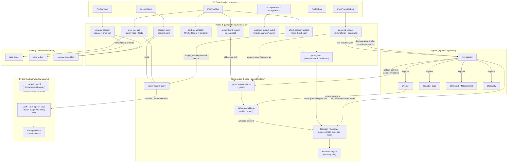

# SYSTEM_OVERVIEW.md

> **Status:** Canonical integrated entry point — how devmate's pieces work **together**. Component depth stays in [ARCHITECTURE.md](./ARCHITECTURE.md), the agent roster in [AGENTS.md](./AGENTS.md), each mechanism in its own reference (see [README.md](./README.md)). Everything below describes **wired** behavior; anything weaker carries its honest `Enforcement` tag from [PATTERNS.md](./PATTERNS.md).

devmate is one closed loop: a request is **classified** into a lane and budget class, **gated** through a deterministic pipeline whose transitions demand artifact proof, **guarded** at every tool call by fail-closed hooks, **remembered** as pointers rather than transcripts, and **re-verified forever** by a CI eval floor. No single component is exotic; the system is the wiring.

## 1. The system at a glance (mermaid component graph)



Reading the graph: the **host events** column is the only entry point — everything devmate does at runtime is a hook reacting to one of those events or an agent the orchestrator dispatched. The **state** column is the shared spine: every guard reads it, every advance writes it, and the **trace** is the append-only record that memory, resume, and the trajectory eval all replay. CI closes the loop from the outside.

## 2. One request, end to end (continuous walkthrough)

One feature request ("add checkout receipts"), from prompt to PR. Per-lane step lists live in [ARCHITECTURE.md](./ARCHITECTURE.md) — this is the continuous view with the wiring that fires between the steps.

1. **Prompt arrives.** The `UserPromptSubmit` hook (`hooks/approval-listener.mjs:289`) runs the semantic skill matcher — no LLM call — over the merged plugin ∪ workspace catalog, re-ranks the top matches on the durable workflow state (force-including the active lane skill), and persists ranked matches to `.devmate/state/skill-matches.json` while logging every candidate to `.devmate/state/skill-decisions.jsonl`; on new-task/steer turns it also emits the model-visible skill menu so the model can self-select. The orchestrator is instructed to load only matched skills (`agents/orchestrator.agent.md:48`, `Enforcement: hook-runtime` for the matching, `prompt-only` for the load discipline). Full pipeline: [skill-matching.md](./skill-matching.md).
2. **Classification.** The orchestrator dispatches `@router`, which returns `{lane, budgetClass, confidence}` as `router-result.json`. The `lane-set` gate's precondition (`lib/gate-preconditions.mjs`) refuses the advance unless the artifact exists and confidence ≥ 0.75 — low confidence escalates to the human instead of guessing.
3. **Contract before work.** After plan approval the orchestrator invokes `init-task-state` (`agents/orchestrator.agent.md:70`, `Enforcement: prompt-only` — nothing yet blocks contract-less work): `classifyBudget` (`lib/context/output-contract.mjs:45`) assigns `tiny | standard | large` and `persistBudget` (`:104`) writes the `OutputContract` (done-when, evidence requirements, `token_budget_class`, `max_context_sources`) into `task.json`. `route-model` then writes an **advisory** model hint to `model-route.json` (`scripts/route-model.mjs`); a verified model ID is honored only when a committed eval baseline exists for its class (`lib/routing/policy-guard.mjs`), and a verified ID without a baseline is refused outright.
4. **Pre-implementation spine.** Discovery runs as a two-phase fan-out (FO-5): a deterministic candidate scan (`scripts/discovery-scan.mjs`, zero LLM cost) either falls back to a single `@discovery` dispatch or feeds K scoped `@discovery` workers on disjoint candidate partitions (`lib/discovery/partition.mjs`; K = 2 standard / 3 large), dispatched in waves with `@tech-design` under sub-agent isolation, and `scripts/merge-discovery.mjs` fans the worker artifacts into one merged artifact (`.devmate/state/discovery-merged.json`) the rest of the lane consumes as a single discovery result; `@rubber-duck` grills the discovery output, the plan is critiqued, and `writeSpec()` produces `.devmate/session/spec.md` with its SHA-256 digest recorded in `task.json` (`docs/artifacts.md`). Each gate advance (`discovery-done → grill-done → plan-done → spec-draft`) goes through the unified transition table (`lib/gate-transitions.mjs:14`) — both the CLI (`gatectl`) and hook paths derive from the same table (`lib/gatectl.mjs:17`), so they cannot disagree — and each target gate's precondition demands its artifact.
5. **The human gate.** The orchestrator presents the spec with explicit options and classifies the reply per the gate conversation protocol (§5): an explicit affirmative in any phrasing advances `spec-draft → spec-approved` via an orchestrator-issued `gatectl workflow approve` carrying the actor + verbatim-evidence audit pair (`lib/gatectl.mjs:168`); the exact phrase `approve spec` stays a zero-cost hook fast path (`hooks/approval-listener.mjs:10`); anything else is revision feedback and the workflow stays at the gate. From this point the spec bytes are load-bearing: on every `PostToolUse`, `spec-integrity-guard` recomputes the digest and an unapproved edit rolls the gate back to `spec-draft` with a `spec_invalidated` trace event (`hooks/spec-integrity-guard.mjs:213`).
6. **Implementation under guard.** After `impl-started`, every tool call passes the `PreToolUse` gate-guard (`lib/gate-guard-core.mjs:399`): source edits are denied before the gate allows them, denied outside the active persona's scope, denied without prior test evidence (TDD pre-condition), and shell commands go through the default-deny analyzer (`lib/gate-guard-core.mjs:140`) so redirects and in-place editors can't bypass the tool matrix. `@fullstack` workers (one per persona) run in isolation; `SubagentStart` denies fan-out beyond `maxConcurrentAgents` (`hooks/subagent-budget-guard.mjs:94`); worker returns are validated live (`hooks/contract-validator.mjs:33`) and their evidence pointers resolved (`:231`) — transcripts never come back, contracts do.
7. **Every tool call is metered and remembered.** `post-tool-use` appends an `action` trace event (identity + digest, never content) and writes compact facts to the task ledger (`lib/memory/fact-writer.mjs:153`). `check-session-budget` reads the contract's budget class and appends `budget_warning` events when thresholds are crossed (`scripts/check-session-budget.mjs:104`); a critical breach writes a marker that makes the gate-guard deny further source edits until compaction clears it (`lib/gate-guard-core.mjs:440`).
8. **Verification is an artifact, not a claim.** The verify→fix→verify loop runs with structural stop controls — file-churn cap, no-progress detection, cost cap, `shell:false` spawns (`lib/loop/loop-guard.mjs:33`), and capped output with digests instead of raw logs (`lib/loop/output-cap.mjs:91`). Passing writes `verify-result.json`; the `verification-passed` precondition accepts it only if it says `passed`, is fresh (≤ 30 minutes), and its `specDigest` matches the approved spec — stale or mismatched evidence refuses the gate.
9. **PR and done.** `@security` reviews the diff; the human approves the PR — classified per the same protocol, with nonstandard phrasing confirmed before advancing (`verification-passed → pr-ready`: orchestrator-issued approve with actor + evidence, or the exact `approve pr` fast path, `hooks/approval-listener.mjs:11`) — and `done` closes the lane.
10. **Session end / interruption.** On `PreCompact` (or a critical budget breach), `compact-session` reduces the evidence pack (`scripts/compact-session.mjs:90`), writes a resume-sufficient compaction artifact (`canResumeFromCompaction`, `lib/context/compaction.mjs`), and **transactionally** promotes the task ledger into the repo ledger — temp write, atomic rename, verify-before-delete (`lib/memory/promote.mjs:210`). A new session's `SessionStart` hook rebuilds a resume plan from the trace and artifacts; nothing depends on replaying chat history.

## 3. The closed loop: classify → budget → route → gate → eval

The E9 spine turned five silos into one loop (verbatim chain):

```
classifyBudget (E9-06) → persistBudget → check-session-budget consumes class (E9-07)
  → routeModel advisory (E9-11) → gate preconditions (E9-15) → verify evidence gate (E9-13)
  → token-budget/trajectory evals keep it honest (E9-21, E9-23)
```

- **Classify:** every task gets a budget class at contract time — the single value the rest of the loop keys on.
- **Budget:** the session-budget hook reads that class (never a hardcoded number) and emits observable `budget_warning` trace events; critical escalates to an edit-blocking marker.
- **Route:** the same class drives the advisory model hint; routing can only become *enforcing* for a class with a verified model ID **and** a committed eval baseline (`evals/model-routing/`) — cost/quality claims must be measured before they steer anything.
- **Gate:** transitions are legal only per the unified table, and *provable* only via preconditions — the loop's verify evidence (fresh, spec-matched `verify-result.json`) is what opens `verification-passed`.
- **Eval:** CI replays the whole story every build: the token-budget eval drives the real budget/compaction/memory libraries over a synthetic long trajectory (`evals/token-budget/`), the trajectory eval scores recorded traces for process violations — edits before impl, illegal gate jumps, missing budget events, tool-call sprawl (`evals/trajectory/`), the regression runner emits its summary artifact (`scripts/run-regressions.mjs`), and `check-docs-drift` validates that every `Enforcement:` claim in PATTERNS.md matches the actual CI/hook wiring (`lib/docs-drift.mjs`). An opt-in nightly LLM-judge tier exists for what code can't verify (claim truth, AC testability) and never gates merges (`scripts/eval-judge.mjs`).

The loop is closed because each stage's output is the next stage's *checked input*, and the final stage (evals) re-verifies the earlier ones forever.

## 4. Why it is shaped this way (rationale & benefits)

- **Workflow-first, agent-second** ([PATTERNS P1](./PATTERNS.md)). The stage order is a frozen data table, not model judgment. Benefit: failures localize to a stage with an artifact trail; the same request takes the same path twice. The model is a worker inside the workflow — never the scheduler.
- **One code writer at a time, in scope.** Only the dispatched `@fullstack` persona writes source, inside `editableGlobs` ownership enforced by the gate-guard — analysts and reviewers advise through contracts. Benefit: no two agents fighting over a file, and every source change is attributable to one persona, one gate, one trace.
- **Structural over prompt enforcement** ([PATTERNS P3](./PATTERNS.md), and the `Enforcement` field generally). A rule that lives only in prose gets crossed; devmate prefers rules that are *impossible* to break (types with no transcript field, tables with no illegal edge) or *blocked* at runtime (fail-closed hooks), and labels the remainder honestly — `prompt-only` and `aspirational` are visible tags (e.g. TCM-1/TCM-2), machine-checked in CI so the docs cannot claim otherwise. Benefit: the gap between "documented" and "built" is a failing build, not a discovery six weeks later.
- **Pointers over pastes, contracts over transcripts** (TCM-3, TCM-9, TCM-10). Evidence is `{path, lines, why, confidence}`; tool output is capped behind digests; workers return typed findings. Benefit: context cost scales with *relevance*, not with how noisy the work was — which is the product's core claim.
- **Human gates only where judgment is human** (spec approval, PR approval). Everything mechanical is auto-advanced on proof. Benefit: the human reviews meaning twice, instead of babysitting mechanics ten times.

## 5. The per-turn conversational lifecycle (E10)

The walkthrough above is what happens when the human stays on script. The E10 layer makes the same guarantees hold for every *off-script* turn, under one stance: **the LLM interprets human input, the state machine validates the resulting transition, and hooks enforce it deterministically.** Each in-flight message goes through the same lifecycle:

1. **Re-anchor** — the `UserPromptSubmit` hook prints the model-visible devmate-state block (taskId, lane, gate, step, legal next gates projected from the unified transition table) built by `buildStateAnchor` (`lib/orchestrator/state-anchor.mjs:92`); `SessionStart` re-anchors resumed and compacted sessions the same way.
2. **Classify** — the hook's deterministic fast path persists a per-prompt intent verdict (`hooks/approval-listener.mjs:476`); deferred turns are classified by the orchestrator as a structured intent object before any action, with hard safe defaults: question / status / chat turns are read-only, and ambiguity at a pending human review defaults to revision, never approval.
3. **Act** — approval becomes an orchestrator-issued `gatectl workflow approve` carrying the actor + verbatim-evidence audit pair (refused without it, `lib/gatectl.mjs:168`); feedback in any phrasing re-dispatches the artifact author while the gate holds; scope changes map to the steering edges of the canonical table (`lib/gate-transitions.mjs:63`) — revise-scope, re-plan, new-requirements, park/resume, abandon — preserving the taskId and completed work.
4. **Re-verify forever** — the gate-robustness eval replays paraphrased approvals, change requests, and interruptions through the real modules in CI and grades only the resulting end state, with a never-false-approve property (`evals/gate-robustness/`).

The authoritative narrative (three-layer model, lifecycle diagram, intent-to-action table) is [orchestrator-conversation.md](./orchestrator-conversation.md); the layer is catalogued as patterns P16–P18 alongside P13–P15 in [PATTERNS.md](./PATTERNS.md).

_The integrated end-to-end flow diagram inside ARCHITECTURE.md is E9-29's follow-up; this document is the canonical map._
