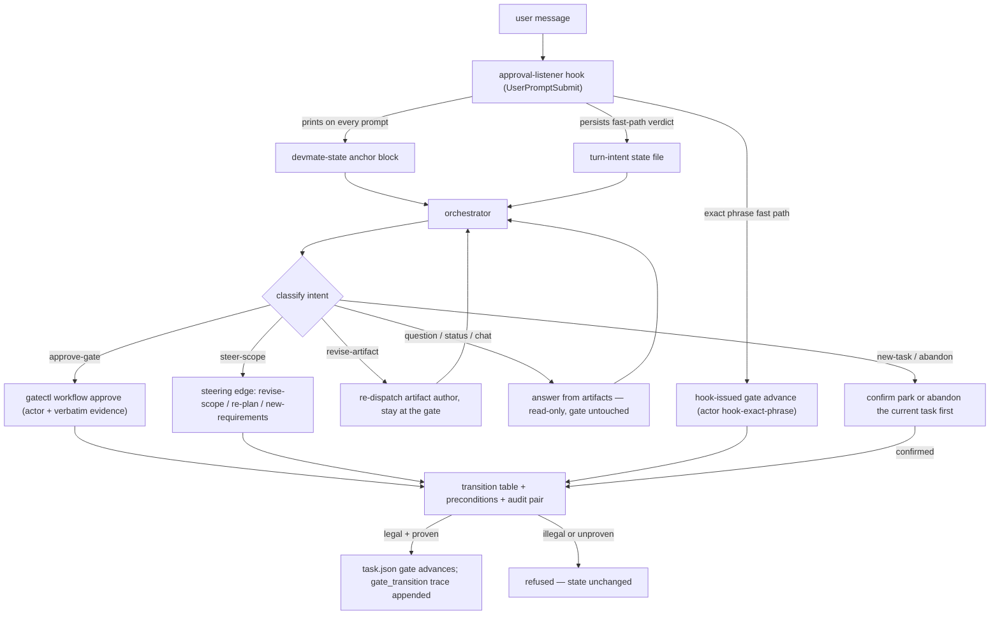

# Orchestrator Conversation — the per-turn lifecycle

> **Status:** Authoritative for the cross-cutting conversational narrative — how one user
> turn flows through the redesigned orchestrator (epic-10) and how the three layers
> interact. Each mechanism stays authoritative in its own reference:
> [workflow.md](./workflow.md) (gates, the conversation protocol, per-turn routing),
> [gates.md](./gates.md) (gatectl syntax, actor/evidence, steering events),
> [hooks.md](./hooks.md) (hook registrations, the state-anchor block),
> [parallel-dispatch.md](./parallel-dispatch.md) (dispatch partitioning), and
> [PATTERNS.md](./PATTERNS.md) (design patterns P13–P18 with enforcement status).
> Design rationale and field survey: [research/orchestrator-redesign.md](./research/orchestrator-redesign.md).

## The three-layer model

Epic-10 replaced the exact-match approval design with one architectural stance:

> **The LLM interprets human input, the state machine validates the resulting
> transition, and hooks enforce it deterministically.**

Code never guesses intent; the model never bypasses a precondition. Each layer does only
what it is good at:

| Layer | Owns | Where it lives |
| --- | --- | --- |
| **LLM interprets** | Classifying every in-flight message (turn routing), the human-gate conversation protocol (explicit-affirmative approval, default-to-revision, questions answered in place), mapping steering requests to edges | Turn routing preamble + "Human gates — input handling" in `agents/orchestrator.agent.md` |
| **State machine validates** | Edge legality (one canonical transition table incl. steering edges), artifact preconditions, the actor + evidence audit pair on human-gate advances | `lib/gate-transitions.mjs`, `lib/gate-preconditions.mjs`, `lib/gatectl.mjs` (advanceHumanGate), `scripts/gatectl.mjs` |
| **Hooks enforce** | Re-anchoring the model from durable state each turn, the deterministic turn-intent fast path, the exact-phrase approval fast path, fail-closed tool/scope/budget guards | `hooks/approval-listener.mjs`, `scripts/session-start.mjs`, `scripts/gate-guard.mjs`, the rest of `hooks/hooks.json` |

The layers are complementary, not redundant: the model can only *propose* a transition
(by running gatectl), the tables and preconditions decide whether it is *legal and
proven*, and the guards make sure nothing else — a stray edit, an over-eager dispatch —
happens around it.

## The per-turn lifecycle

Every user message after lane classification goes through the same five stages:

1. **Receive.** The message arrives; the UserPromptSubmit hook fires before the model
   sees it.
2. **Re-anchor.** The hook prints the model-visible devmate-state block — taskId, lane,
   gate, step, pending artifact, and the legal next gates projected from the unified
   transition table — so the turn starts from durable state, not conversational memory.
   Session starts with a task in flight re-anchor the same way. Details:
   [hooks.md — Workflow-state anchor](./hooks.md).
3. **Classify.** The hook's deterministic fast path labels exact approval/revision
   phrases (and trivially-new-task turns at `no-lane`/`done`) and persists its verdict
   to the turn-intent state file; every deferred turn is classified by the orchestrator
   as a structured intent object (intent, confidence, target artifact) before any other
   action. Details: [workflow.md — Per-turn intent routing](./workflow.md).
4. **Act** per the intent-to-action table below — advance, revise, answer, steer, or
   dispatch. Read-only intents never mutate gate state; ambiguity at a human review
   defaults to revision, never approval.
5. **Validate + trace.** Whatever the model decided, the transition only happens if the
   canonical table has the edge, the target gate's precondition is proven, and — for
   `spec-approved` / `pr-ready` — the actor + evidence audit pair is present; the
   resulting gate_transition trace event records who moved the gate and the verbatim
   human words that justified it. Details: [gates.md](./gates.md).

## Intent → action (summary)

The full table and its hard rules live in the Turn routing preamble of
`agents/orchestrator.agent.md`; [workflow.md](./workflow.md) documents the two-stage
classification. In summary:

| Intent | Action | Gate effect |
| --- | --- | --- |
| new-task | Route through lane classification (after park/abandon confirmation if a task is in flight) | New workflow |
| approve-gate | Orchestrator-issued gatectl advance with actor + verbatim evidence | Advances |
| revise-artifact | Re-dispatch the artifact author with the feedback; re-present the gate | Stays |
| steer-scope | Map to a steering edge (revise-scope / re-plan / new-requirements) | Stays (moves backward legally) |
| question / status / chat | Answer or report from task state and artifacts | **Never mutates** |
| abandon | Confirm explicitly, then take the abandon edge to the terminal | Only after confirmation |

Safe defaults are hard rules of the prompt: read-only intents can never advance, reset,
or abandon a gate; confidence below the shared 0.75 threshold while a human review is
pending defaults to revise-artifact; low confidence anywhere else asks the human instead
of guessing.

## A worked example at the spec gate

The workflow sits at `spec-draft`; the orchestrator has presented spec.md and listed the
options (approve / request changes / ask a question / abandon).

- **"hmm, what about auth?"** — classified as a question-shaped concern → revision
  feedback (default-to-revision). @spec-writer is re-dispatched with the concern, the
  workflow stays at `spec-draft`, the gate is re-presented. No approval is inferred.
- **"yep ship it"** — an explicit affirmative → the orchestrator runs
  `gatectl workflow approve spec-approved --actor orchestrator --evidence "yep ship it"`.
  The state machine checks the edge and the spec-artifact precondition, persists the new
  gate, and appends the audited trace event; the lane continues into implementation.
- **"actually, let's rework this as a CLI instead"** — a scope change → the steering
  layer, not a derailment: at `spec-draft` the new-requirements edge steps back to
  `grill-done` with the same taskId and all completed work preserved
  ([workflow.md — Steering paths](./workflow.md)).
- **"approve spec"** — the exact phrase remains a zero-cost hook fast path: the
  approval listener advances the gate itself, stamping actor hook-exact-phrase with the
  raw prompt as evidence.

Off-script input therefore never stalls dispatch: there is no required phrase, and the
feedback-revision cycle continues until explicit approval arrives.

## Safety properties

- **Default-to-revision.** Ambiguous input at a human gate is treated as revision;
  approval must be explicit and is never inferred. Worst-case misclassification is one
  extra round-trip, never an unintended implementation dispatch.
- **Read-only turns are read-only.** question / status / chat can never move a gate, no
  matter how they are phrased.
- **Every human-gate advance is audited.** Entering `spec-approved` or `pr-ready`
  without a non-empty actor + evidence pair throws / exits non-zero; the trace event
  carries both fields.
- **The graph bends instead of breaking.** Steering, parking, resuming, and abandoning
  are legal, precondition-gated transitions that preserve the task.
- **Regression-graded end-to-end.** The gate-robustness eval drives paraphrased
  approvals, change requests, and interruptions through the real modules and grades
  only the resulting end state at k trials, with a never-false-approve property
  (`evals/gate-robustness/`, PATTERNS P15).

## Pattern index

| Pattern | Covers |
| --- | --- |
| [P16 — Conversational gate protocol](./PATTERNS.md) | Classify-first human gates, default-to-revision, orchestrator-issued audited advances |
| [P17 — Per-turn state re-anchoring](./PATTERNS.md) | The devmate-state block on every prompt and session start |
| [P14 — Per-turn intent routing](./PATTERNS.md) | Deterministic fast path + structured LLM classification |
| [P18 — Steering edges](./PATTERNS.md) | Scope changes, park/resume, abandon as legal transitions |
| [P13 — Effort-scaled dispatch](./PATTERNS.md) | Fan-out sized to budget class; complete dispatch payloads |
| [P15 — Conversational-robustness evals](./PATTERNS.md) | End-state grading, pass^k, never-false-approve |

## Grounding

Official sources only (full survey in
[research/orchestrator-redesign.md](./research/orchestrator-redesign.md)):

- [Anthropic, Building effective agents](https://www.anthropic.com/engineering/building-effective-agents) — workflows vs. agents; routing; orchestrator-workers.
- [Anthropic, Multi-agent research system](https://www.anthropic.com/engineering/multi-agent-research-system) — re-anchor from durable/external state; explicit effort-scaling rules; end-state evaluation.
- [LangGraph, Interrupts](https://docs.langchain.com/oss/python/langgraph/interrupts) — a gate is a durable, resumable pause.
- [LangChain, Human-in-the-loop](https://docs.langchain.com/oss/python/langchain/human-in-the-loop) — typed approve/edit/reject/respond resume decisions.
