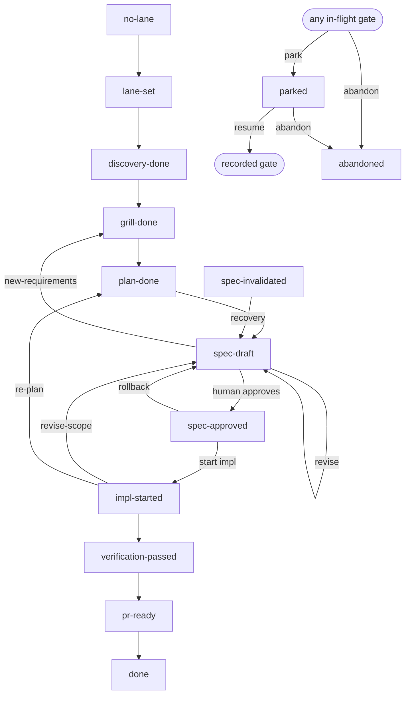

# DevMate Workflow Gates

DevMate uses a linear gate pipeline plus explicit steering edges (E10-05) for
mid-workflow scope changes. Each gate represents a meaningful stage of work and
controls what actions the agent is permitted to take.

## State diagram



## Gate reference

| Gate                  | Meaning                                          | Who advances it                           | Human gate? |
| --------------------- | ------------------------------------------------ | ----------------------------------------- | ----------- |
| `no-lane`             | Session started; no lane assigned                | Initial state                             | No          |
| `lane-set`            | Lane classified by @router (confidence ≥ 0.75)   | @router returns result; <0.75 → escalate to human | No          |
| `discovery-done`      | Codebase read; affected files identified         | Orchestrator (internal)                   | No          |
| `grill-done`          | Rubber-duck grill phase complete                 | Orchestrator (internal)                   | No          |
| `plan-done`           | Step-by-step plan generated                      | Orchestrator (internal)                   | No          |
| `spec-draft`          | `spec.md` written; awaiting human review         | Orchestrator (after internal stages)      | No          |
| `spec-approved`       | Human approved spec                              | Orchestrator-issued `gatectl workflow approve` (actor + evidence); `approve spec` hook fast path | **Yes**     |
| `spec-invalidated`    | Spec edited after approval; re-approval required | `spec-integrity-guard.mjs`                | No          |
| `impl-started`        | Orchestrator begins dispatching implementation   | Orchestrator (after `spec-approved`)      | No          |
| `verification-passed` | Loop engine: all acceptance criteria pass        | Loop engine                               | No          |
| `pr-ready`            | Human approved PR                                | Orchestrator-issued `gatectl workflow approve` (actor + evidence); `approve pr` hook fast path   | **Yes**     |
| `done`                | PR created or task complete                      | Orchestrator                              | No          |
| `parked`              | Task paused; resume pointer records the gate to return to (E10-05) | Orchestrator on a park request            | No          |
| `abandoned`           | Task deliberately dropped; terminal (E10-05)     | Orchestrator after explicit confirmation  | No          |

## Source-edit rule

Source edits (writes to `.mjs`, `.ts`, `.js`, `.json`, etc.) are **blocked** until
the gate reaches `impl-started`. The gate guard (`lib/gate-guard.mjs`) enforces
this via Rule 3.

## Human gates

Only two gates require explicit human input:

- **`spec-approved`** — human approves the spec to advance from `spec-draft`.
- **`pr-ready`** — human approves the PR to advance from `verification-passed`.

All other gates are advanced automatically by the orchestrator or loop engine.

### Gate conversation protocol

No specific phrase is required at a human gate. The exact phrases `approve spec` and
`approve pr` remain the fast path recognized by the approval-listener hook, and
`revise spec:` still carries an explicit revision reason — but they are optional. The
orchestrator prompt defines a "Human gates — input handling" protocol that applies at
every human gate: when the orchestrator presents a gate artifact it lists the available
options (approve / request changes / ask a question / abandon) and classifies the next
user message before taking any other action.

- Explicit approval (an unambiguous affirmative) advances the gate.
- Any requested change, correction, addition, or concern — regardless of phrasing — is
  treated as revision feedback: the artifact author is re-dispatched with the feedback
  and the workflow stays at the gate (default-to-revision).
- A question is answered from the artifacts; answering a question never advances or
  abandons the gate.
- Input that is ambiguous between approval and change is treated as revision — approval
  must be explicit and is never inferred.
- A new, unrelated task prompts a confirmation to park or abandon the current task first.

Off-script input therefore never stalls the workflow: the orchestrator continues the
feedback-revision cycle until explicit approval arrives, and it never stops dispatching
subagents because a message failed to match an expected phrase.

Every human-gate transition carries an audit pair on its `gate_transition` trace event:
`actor` (who issued the transition) and `evidence` (the verbatim human message that
approved it). After classifying explicit approval, the orchestrator issues the advance
itself — `gatectl workflow approve` with `--actor orchestrator` and the user's verbatim
message as `--evidence` — while the exact-phrase hook fast path stamps actor
"hook-exact-phrase" with the raw prompt as evidence. A human-gate transition without
actor + evidence is rejected (CLI exits non-zero; the API throws). Subcommand syntax and
examples: [gates.md](./gates.md).

## Recovery paths

- `spec-invalidated → spec-draft`: if `spec.md` is edited after approval, the
  integrity guard moves the pipeline back to `spec-draft` and re-approval is
  required before implementation can proceed.
- `spec-approved → spec-draft` (rollback): the approval-listener can roll back
  to `spec-draft` if the spec needs revision after approval.
- `spec-draft → spec-draft` (revise): re-entry is legal so the spec-writer can
  overwrite `spec.md` without a gate error.

## Steering paths

Mid-workflow scope changes are legal transitions (E10-05), not illegal-transition
dead ends. Every steering move continues the same task: the taskId and all
completed work are preserved — mirroring the chore lane's "never restart the
workflow from the top" rule (chore step 9) — and each move is gated by a
precondition artifact:

- `impl-started → spec-draft` (event: revise-scope): scope change mid-build.
  Requires a captured scope-change note at `.devmate/state/scope-change.json`
  for the current task; the spec loop re-runs with the preserved taskId, spec
  metadata, and completed workstreams intact (the feature lane applies this
  via its steering helper, which mirrors the continue-approved path).
- `impl-started → plan-done` (event: re-plan): approach change without a scope
  change. Re-checks the existing critique-result precondition on entry.
- `spec-draft → grill-done` (event: new-requirements): pre-implementation
  backward step when new requirements surface at spec review. Re-checks the
  existing grill-result precondition.
- any in-flight gate → `parked` (event: park): pause the task. Refused unless a
  resume pointer is persisted at `.devmate/state/resume-pointer.json` recording
  the taskId and the gate to return to. "In-flight" means every gate except
  `no-lane` and the terminals.
- `parked` → the recorded gate (event: resume): the resume pointer names the
  target, and that target's own precondition is re-checked on entry.
- any in-flight gate (or `parked`) → `abandoned` (event: abandon): deliberate
  terminal, issued only after the explicit confirmation required by the gate
  conversation protocol above.

A terminal task never wedges the workspace: once the gate is `done` or
`abandoned`, nothing can transition out of it, so the next `SessionStart`
bootstraps a fresh task (at `no-lane`, with a new taskId) over the finished
`task.json`. The finished task's session artifacts are left in place but
ignored — they carry the old taskId, so every ownership-checking gate
precondition refuses them as stale evidence. A `parked` task is a pause, not a
terminal: a fresh session keeps it intact for a later resume.

When the per-turn router (E10-4) classifies an in-flight message as a
`steer-scope` intent during implementation, the orchestrator maps it to one of
these edges instead of restarting the workflow or dead-ending on an
illegal-transition error.

## Feature lane — 11-step procedure

The orchestrator (`agents/orchestrator.agent.md`) follows a strict 11-step
feature lane. Steps 3, 5, and 7 are internal gates that auto-advance; step 10
is the only human gate before implementation.

```
1.  Ingest request — classify lane, set budget class
2.  Discovery + tech-design dispatch
3.  [INTERNAL GATE] discovery-done
4.  Rubber-duck (mode=grill) — assumptions, edgeCases, blockingQuestions
      → blockingQuestions seed the spec.md "Assumptions — please verify" list
5.  [INTERNAL GATE] grill-done
6.  Planner — step plan + AC checkboxes + per-AC test mapping
7.  [INTERNAL GATE] plan-done
8.  Rubber-duck (mode=critique, iterationNumber=1)
      → verdict APPROVE_PLAN          → step 9
      → verdict REQUEST_REVISION:<r>  → planner revision (plan_revised, rev=1)
                                       → rubber-duck iterationNumber=2
                                          → still REQUEST_REVISION? fold open
                                            issues into SpecContent.risks with
                                            a risk flag and continue
9.  spec-writer.writeSpec(repoRoot, content) → .devmate/session/spec.md
10. [HUMAN GATE] spec-draft — human reviews spec.md
11. explicit approval ("approve spec" hook fast path, or orchestrator-issued
      gatectl workflow approve spec-approved with actor + evidence)
      → spec-approved → impl-started → fullstack dispatch
      → per completed acceptance criterion: complete-ac.mjs records an
        impl-AC{n} step_complete + checks off the spec.md checkbox
```

At `impl-started`, implementation progress is tracked per acceptance criterion.
The spec-writer persists the ordered criteria into task.json, giving each a
stable positional id (impl-AC{n}). As each criterion's mapped test reaches GREEN
(reported by fullstack's completedAcIds), the orchestrator runs
`scripts/complete-ac.mjs`: it records a canonical impl-AC{n} step_complete in the
trace and checks off the matching spec.md checkbox. On resume, buildResumePlan
joins the trace with the persisted list to report "X/Y ACs complete, next
AC{n}", and the orchestrator dispatches only the criteria that are not yet
complete — a completed criterion is never re-implemented. See
`docs/artifacts.md` for the storage model.

The critique iteration cap of 2 is a hard rule of the orchestrator prompt. The
`grill_complete`, `critique_complete`, and `plan_revised` trace events emitted
at steps 4 and 8 give the post-session audit trail (see
`docs/CURRENT_BEHAVIOR.md` and the E11-3 typedefs in `lib/types.mjs`).

## Per-turn intent routing

Lane classification happens once, but steering happens on every message. Each
in-flight user turn is therefore classified against the current gate before
the orchestrator acts (E10-4), in two stages:

1. **Deterministic fast path** (zero cost, in the approval-listener hook on
   `UserPromptSubmit`): exact approval/revision phrases classify directly,
   and when the gate is `no-lane` or `done` (nothing in flight) the message
   is trivially a new task. The verdict — or an explicit deferral — is
   persisted to `.devmate/state/turn-intent.json` for the orchestrator and
   the state anchor to read. See `lib/routing/turn-intent.mjs`.
2. **LLM classification** (the orchestrator's "Turn routing" preamble in
   `agents/orchestrator.agent.md`): deferred turns are classified as a
   structured intent object with a confidence score and target artifact
   before any action is taken.

The intent vocabulary is: `new-task`, `approve-gate`, `revise-artifact`,
`steer-scope`, `question`, `status`, `abandon`, `chat`.

Safe-default rules (hard rules of the orchestrator prompt):

- `question`, `chat`, and `status` are read-only turns — they never advance,
  reset, or abandon a gate.
- Low confidence (below the shared 0.75 escalation threshold) while a human
  review is pending defaults to `revise-artifact` — an ambiguous message is
  never treated as approval.
- Low confidence anywhere else routes to an explicit ask, mirroring the
  router's lane-confidence escalation convention.
